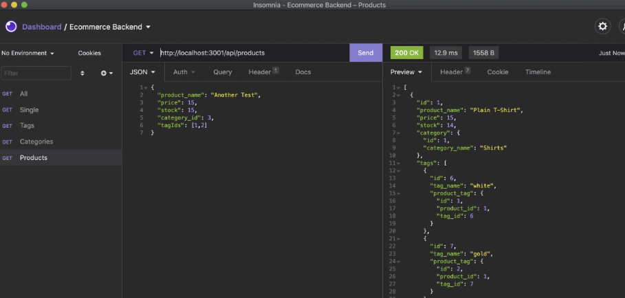

# ecommerce-backend
ecommerce backend takes an express.js API and configures it to use Sequelize to interact with a MySQL database

## Table of Contents
* [Installation](#installation)
* [License](#license)
* [Built With](#built-with)
* [Heroku](#heroku)
* [Questions](#questions)
* [Credits](#credits)

## Installation
Install necessary dependencies before use. Run "npm run seed" and "npm start" in the terminal. Then switch into Insomnia to edit database data.

## License
This application uses the MIT license.

## Built With
* NPM
* Express
* MySQL2
* Sequelize
* Dotenv

## Walkthrough Video

## Questions
Feel free to contact regarding any questions you may have. 
Github: https://github.com/wamackie 
Email: wamackie8456@gmail.com

## Credits
Ecommerce-backend was created by William Mackie